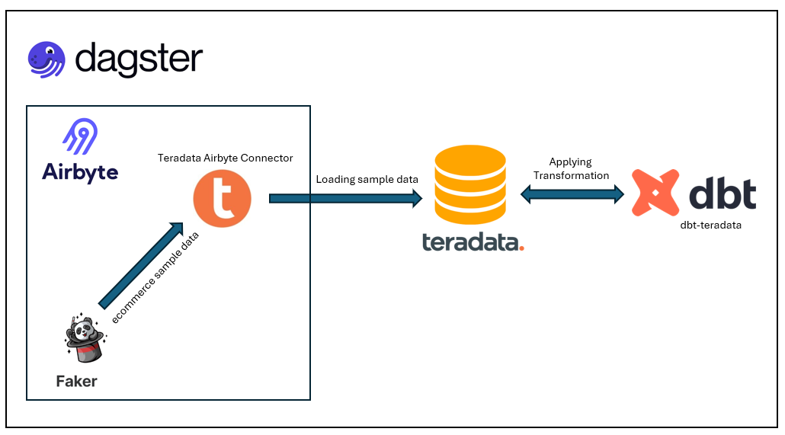
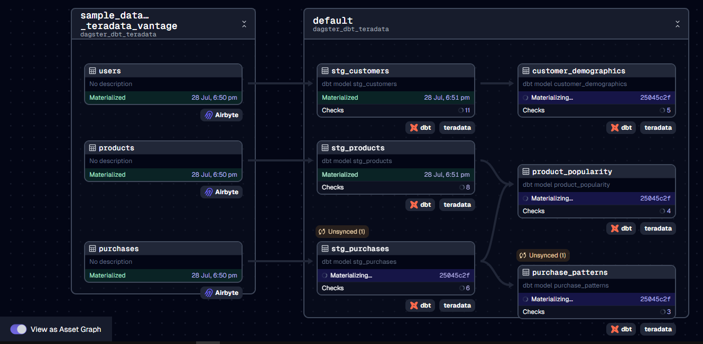
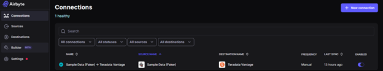

# Airbyte-dbt-Dagster-Teradata Integration

Welcome to the "Airbyte-dbt-Dagster-Teradata Integration" tutorial! This tutorial offers a quick start template for constructing a complete data stack utilizing Airbyte, Dagster, dbt, and Teradata Vantage. With this template, you can effortlessly extract sample data from "Sample Data (Faker)" and load it into Teradata Vantage using Airbyte, perform necessary transformations using dbt-teradata, and seamlessly orchestrate everything with Dagster. 

While this template does not dive into specific data or transformations, it aims to demonstrate the powerful combination of these tools with Teradata Vantage. This quick start is designed to simplify setup and accelerate your progress. 
## Table of Contents


- [Airbyte-dbt-Dagster-Snowflake Integration](#airbyte-dbt-dagster-teradata-integration)
  - [Table of Contents](#table-of-contents)
  - [Infrastructure Layout](#infrastructure-layout)
  - [Pipeline DAG](#pipeline-dag)
  - [Prerequisites](#prerequisites)
  - [1. Setting an environment for your project](#1-setting-an-environment-for-your-project)
  - [2. Setting Up the dbt Project](#3-setting-up-the-dbt-project)
  - [3. Orchestrating with Dagster](#4-orchestrating-with-dagster)
  - [Next Steps](#next-steps)

## Infrastructure Layout



## Pipeline DAG


## Prerequisites

Before you embark on this integration, ensure you have the following set up and ready:

1. **Python 3.10 or later**: If not installed, download and install it from [Python's official website](https://www.python.org/downloads/).

2. **Airbyte OSS version**: Deploy the open-source version of Airbyte. Follow the installation instructions from the [Airbyte Documentation](https://medium.com/teradata/manage-elt-pipelines-with-code-using-terraforms-airbyte-provider-e79378fdf127).
    <br><br>
In this example, we use Airbyte to load sample data into Teradata Vantage before applying transformations. In Airbyte, we utilize the "Sample Data (Faker)" connector as the source and the Teradata Vantage connector as the destination.     

    

## 1. Setting an environment for your project

Get the project up and running on your local machine by following these steps:

1. **Clone the repository**:  
   ```bash
   git clone https://github.com/teradata/airbyte_dbt_dagster_teradata
   ```
   
2. **Navigate to the directory**:  
   ```bash
   cd airbyte_dbt_dagster_teradata
   ```

3. **Set Up a Virtual Environment**:  
   - For Mac:
     ```bash
     python3 -m venv venv
     source venv/bin/activate
     ```
     - For Windows:
       ```bash
       python -m venv venv
       .\venv\Scripts\activate
       ```

4. **Install Dependencies**:  
   ```bash
   pip install -e ".[dev]"
   ```
   This will install below pip modules and its dependencies: 

   ```commandline
   dbt-teradata==1.8.0
   dbt-core
   dagster==1.7.9
   dagster-webserver==1.7.9
   dagster-dbt==0.23.9
   dagster-airbyte==0.23.9
   ```
## 2. Setting Up the dbt Project

[dbt (data build tool)](https://www.getdbt.com/) allows you to transform your data by writing, documenting, and executing SQL workflows. Setting up the dbt project requires specifying connection details for your data platform, in this case, Teradata. Here’s a step-by-step guide to help you set this up:

1. **Navigate to the dbt Project Directory**:

   Change to the directory containing the dbt configuration:
   ```bash
   cd ../../dbt_project
   ```

2. **Update Connection Details**:

   You will find a `profiles.yml` file within the directory. This file contains configurations for dbt to connect with Teradata Vantage. Update this file with your connection details.


3. **Linking Sources in dbt with Assets in Airbyte (Optional)**:

   To link sources in dbt with the assets in Airbyte, you can use the following configuration in `sources.yml`

   ```bash
   sources:
   - name: airbyte
     tables:
       - name: _airbyte_raw_users
         meta:
           dagster:
             asset_key: ["users"]
   ```

4. **Test the Connection**:

   Once you’ve updated the connection details, you can test the connection to your Teradata instance using:
   ```bash
   dbt debug
   ```

   If everything is set up correctly, this command should report a successful connection to Teradata.

## 3. Orchestrating with Dagster

[Dagster](https://dagster.io/) is a modern data orchestrator designed to help you build, test, and monitor your data workflows. In this section, we will walk you through setting up Dagster to oversee both the Airbyte and dbt workflows:

1. **Navigate to the Orchestration Directory**:

   Switch to the directory containing the Dagster orchestration configurations:
   ```bash
   cd ../orchestration
   ```

2. **Set Environment Variables**:

   Dagster requires certain environment variables to be set to interact with other tools like dbt and Airbyte. Set the following variables:

   ```bash
   export DAGSTER_DBT_PARSE_PROJECT_ON_LOAD=1
   ```

3. **Launch the Dagster UI**:

   With the environment variables in place, kick-start the Dagster UI:
   ```bash
   dagster dev
   ```

4. **Access Dagster in Your Browser**:

   Open your browser and navigate to:
   ```
   http://127.0.0.1:8000
   ```

   Here, you should see assets for both Airbyte and dbt. To get an overview of how these assets interrelate, click on "view global asset lineage". This will give you a clear picture of the data lineage, visualizing how data flows between the tools.

## Next Steps

Once you have set up and launched this initial integration, the real power lies in its adaptability and extensibility. Here’s a roadmap to help you customize and harness this project tailored to your specific data needs:

1. **Create dbt Sources for Airbyte Data**:

   Your raw data extracted via Airbyte can be represented as sources in dbt. Start by [creating new dbt sources](https://docs.getdbt.com/docs/build/sources) to represent this data, allowing for structured transformations down the line.

2. **Add Your dbt Transformations**:

   With your dbt sources in place, you can now build upon them. Add your custom SQL transformations in dbt, ensuring that you treat the sources as an upstream dependency. This ensures that your transformations work on the most up-to-date raw data.

3. **Execute the Pipeline in Dagster**:

   Navigate to the Dagster UI and click on "Materialize all". This triggers the entire pipeline, encompassing the extraction via Airbyte, transformations via dbt, and any other subsequent steps.

4. **Extend the Project**:

   The real beauty of this integration is its extensibility. Whether you want to add more data sources, integrate additional tools, or enhance your transformation logic – the floor is yours. With the foundation set, sky is the limit for how you want to extend and refine your data processes.

### References:

#### To learn more, check out:
* [dbt with Teradata Vantage](https://quickstarts.teradata.com/dbt.html)
* [Tutorial: Using dbt with Dagster](https://docs.dagster.io/integrations/dbt/using-dbt-with-dagster)
* [Understand the Python code in your Dagster project](https://docs.dagster.io/integrations/dbt/using-dbt-with-dagster/load-dbt-models#step-4-understand-the-python-code-in-your-dagster-project)
* [Transform data Loaded with Airbyte using dbt](https://quickstarts.teradata.com/elt/transforming-external-data-loaded-via-airbyte-in-teradata-vantage-using-dbt.html)
* [Manage ELT pipelines with code using Airbyte’s Terraform provider](https://medium.com/teradata/manage-elt-pipelines-with-code-using-terraforms-airbyte-provider-e79378fdf127)
